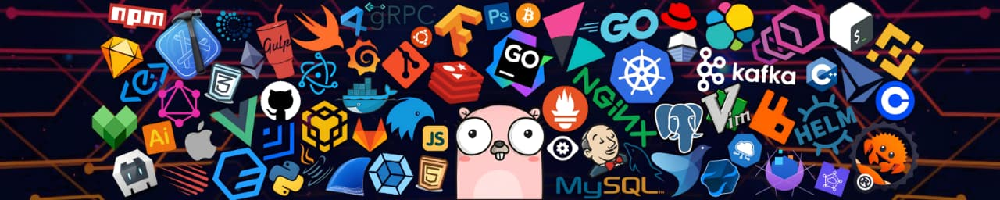

# Hello my friend 👋

I am **Mohamed Ayman**, a 💻 **Machine Learning Engineer & AI Researcher** from Egypt.  
I build predictive models and AI systems for real-world problems. 🌟  

* 🧐 Interested in Machine Learning, Deep Learning, NLP, Computer Vision & AI Research.  
* 💼 Freelance ML projects on [Upwork](https://www.upwork.com/freelancers/~01688164c04bcb0a5b)  
* 🌱 Currently learning advanced ML, Reinforcement Learning, and deploying AI models.  
* 💻 3+ years hands-on experience in ML/AI projects and Python programming.  
* ✍🏻 Writing tutorials & sharing knowledge via GitHub.

  
🏆 Achievements & Certifications

   
* 💡 Active in AI research & ML competitions
* 🌐 Open for collaborations and freelance AI projects

---

## **Languages and Tools:** 

   Python &nbsp;&nbsp;&nbsp;
   TensorFlow &nbsp;&nbsp;&nbsp;
   PyTorch

   Jupyter &nbsp;&nbsp;&nbsp;
   VS Code &nbsp;&nbsp;&nbsp;
   Git

   NumPy

---

## ✨ Featured ML Projects

- [Heart Disease Prediction](https://github.com/Mohamed010Ayman/Heart-Disease-Prediction) – A predictive ML model analyzing patient data to detect heart disease risk.  
- [Fraud Detection](https://github.com/Mohamed010Ayman/Fraud-Detection-ML) – Detect financial fraud using machine learning models.  

---

## 💬 Let's Connect

<a href="https://www.linkedin.com/in/mohamed010ayman" target="_blank"> LinkedIn</a> &nbsp;&nbsp;|&nbsp;&nbsp;
<a href="https://www.upwork.com/freelancers/~01688164c04bcb0a5b" target="_blank"> Upwork</a> &nbsp;&nbsp;|&nbsp;&nbsp;
<a href="https://www.facebook.com/m.hamed.ayman.276319/" target="_blank"> Facebook</a> &nbsp;&nbsp;|&nbsp;&nbsp;
<a href="mailto:mohamed.ayman.yahya1@gmail.com"> Email</a> &nbsp;&nbsp;|&nbsp;&nbsp;
📞 +20 106 497 6258

