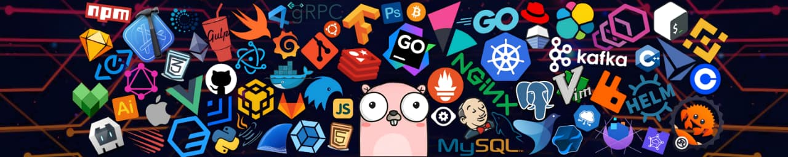

# 👋 Hi, I'm Mohamed Ayman

  

<h3 align="center">
  🤖 Aspiring Machine Learning Engineer | AI Student | Generative AI & RAG Enthusiast
</h3>

  <b>Building practical AI systems with Machine Learning, Deep Learning, NLP & Generative AI.</b>

---

## 👨‍💻 About Me

I'm **Mohamed Ayman**, an Artificial Intelligence student at **Benha University, Egypt**, passionate about building practical AI systems and solving real-world problems.

My main interests are **Machine Learning, Deep Learning, NLP, Computer Vision, Generative AI, RAG, and AI Agents**.

* 🎓 Artificial Intelligence Student at **Benha University**
* 🤖 Focused on **Machine Learning & Generative AI**
* 🔎 Currently exploring **LLMs, RAG, Embeddings, AI Agents & LLM Evaluation**
* 🧠 Interested in building **production-oriented AI systems**
* 💻 Experienced in developing **end-to-end ML & AI applications**
* 🐍 Main programming language: **Python**
* 🚀 Interested in **Generative AI, Agentic AI, RAG & AI Automation**
* 🤝 Open to **Internships, Collaborations & AI/ML Projects**

---

# 🧠 Technical Skills

### 💻 Programming

`Python` `C++` `SQL`

### 🤖 Machine Learning

`Scikit-learn` `Supervised Learning` `Unsupervised Learning`
`Feature Engineering` `Cross-Validation` `Model Evaluation`
`Hyperparameter Tuning`

### 🧠 Deep Learning

`TensorFlow` `Keras`
`CNN` `RNN` `LSTM` `GRU`

### ✨ Generative AI & LLMs

`LLMs` `RAG` `Prompt Engineering`
`Embeddings` `Semantic Search`
`Grounded Generation` `LLM Evaluation`

### 🔤 Natural Language Processing

`Text Preprocessing` `Tokenization`
`Vectorization` `Text Classification`
`Sequence Modeling`

### 🔎 RAG & AI Infrastructure

`LangChain` `Hugging Face`
`Sentence Transformers` `ChromaDB`

### 🤖 Agentic AI

`AI Agents` `Tool Calling` `Agent Loops`
`Multi-Agent Systems` `Agent Memory`
`MCP` `Agent Evaluation` `AI Automation`

### ⚙️ Backend & Development

`FastAPI` `REST APIs` `Uvicorn`
`Git` `GitHub`

### 📊 Data & Visualization

`Pandas` `NumPy` `Matplotlib` `Seaborn`

---

# 🚀 Featured Projects

## 🏥 NG59 Grounded RAG Assistant

An end-to-end **Retrieval-Augmented Generation system** built around the **NICE NG59 clinical guideline**.

### 🔥 Key Features

* 📄 PDF document parsing
* 🧹 Text cleaning & preprocessing
* ✂️ Intelligent text chunking
* 🔢 Embedding generation
* 🔍 Semantic search
* 🎯 Top-K retrieval
* 🗄️ ChromaDB vector database
* 🤖 Grounded question answering
* 📑 Citation validation
* 🛡️ Confidence-based refusal
* 🚫 Unsupported-claim detection
* 📊 Retrieval & answer evaluation
* ⚡ FastAPI backend
* 🌐 Interactive web frontend

### 🛠️ Tech Stack

`Python` `LangChain` `Hugging Face`
`Sentence Transformers` `ChromaDB`
`FastAPI` `RAG` `LLMs`

🔗 **[View Project](https://github.com/Mohamed010Ayman)**

---

## ❤️ Heart Disease Prediction

A Machine Learning classification system designed to predict **heart disease risk**.

### 🔥 Key Features

* Data preprocessing
* Missing-value handling
* Feature engineering
* Multiple classification models
* Model comparison
* Performance evaluation

### 🛠️ Tech Stack

`Python` `Scikit-learn` `Pandas` `NumPy`

🔗 **[View Project](https://github.com/Mohamed010Ayman/Heart-Disease-Prediction)**

---

## 💳 Fraud Detection

A Machine Learning project focused on identifying **fraudulent financial transactions**.

### 🔥 Key Features

* Data preprocessing
* Feature analysis
* Classification modeling
* Model evaluation
* Fraud detection pipeline

### 🛠️ Tech Stack

`Python` `Scikit-learn` `Pandas` `NumPy`

🔗 **[View Project](https://github.com/Mohamed010Ayman/Fraud-Detection-ML)**

---

# 🎓 Education

### Bachelor of Science in Artificial Intelligence

**Faculty of Engineering — Benha University**

📅 **2023 – 2027**

---

# 📜 Training & Certifications

### 🎓 Machine Learning Training — NTI Egypt

Covered:

* Machine Learning using Python
* Scikit-learn
* Supervised Learning
* Unsupervised Learning
* Model Training
* Model Evaluation
* Practical Machine Learning Projects

---

# 📊 GitHub Statistics

---

# 🌐 Connect With Me

<a href="https://www.linkedin.com/in/mohamed010ayman">
  
  LinkedIn
</a>

   •   

<a href="https://www.upwork.com/freelancers/~01688164c04bcb0a5b">
  
  Upwork
</a>

   •   

<a href="mailto:mohamed.ayman.yahya1@gmail.com">
  
  Email
</a>

   •   

📞 **+20 106 497 6258**

---

### 💡 Building AI systems that solve real-world problems.

